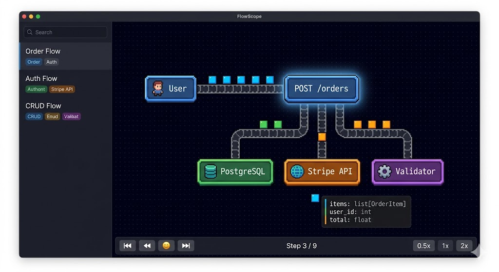

<h1 align="center">OpenHop</h1>

<p align="center">
  <b>Diagrams your AI agent can write.</b><br/>
  Animated, multi-level data flows — described in YAML, drawn by your coding agent.
</p>

<p align="center">
  <a href="#try-it-in-60-seconds">Quickstart</a> ·
  <a href="#give-your-agent-the-skill">AI skill</a> ·
  <a href="#how-it-works">How it works</a> ·
  <a href="#examples">Examples</a>
</p>

<p align="center">
  
</p>

<p align="center">
  <a href="https://github.com/naorsabag/OpenHop/actions/workflows/ci.yml"></a>
  <a href="https://www.npmjs.com/package/openhop"></a>
  <a href="LICENSE"></a>
  <a href="https://github.com/naorsabag/OpenHop/stargazers"></a>
</p>

<p align="center">
  <sub>One-step install (<code>npx openhop init</code>):</sub><br/>
  <a href="https://docs.anthropic.com/en/docs/claude-code/skills"></a>
  <a href="https://cursor.com/docs/skills"></a>
  <a href="https://docs.windsurf.com/windsurf/cascade/skills"></a>
  <a href="https://docs.cline.bot/customization/skills"></a>
  <a href="https://docs.continue.dev/customize/deep-dives/rules"></a>
</p>

<p align="center">
  <sub>Via OpenSkills (<code>npx openskills install naorsabag/openhop</code>):</sub><br/>
  <a href="https://github.com/openai/codex"></a>
  <a href="https://github.com/google-gemini/gemini-cli"></a>
  <a href="https://www.jetbrains.com/junie/"></a>
  <a href="https://github.com/features/copilot"></a>
  <a href="https://opencode.ai/"></a>
  <a href="https://block.github.io/goose/"></a>
  <a href="https://antigravity.google/"></a>
  <a href="https://aider.chat/"></a>
</p>

<p align="center"><sub><sup>* Aider has no skill surface — install the <code>openhop</code> CLI globally and invoke commands via Aider's shell access.</sup></sub></p>

---

## Why

AI coding agents are great at explaining how code works — in 800-line bullet walls you can't verify.
OpenHop is a skill that lets your agent emit **animated data-flow diagrams** instead. You describe
the flow in YAML (your agent writes it for you); OpenHop renders animated data pixels traveling
between components on a pixel-art canvas. Click any node to drill into its sub-flow.

## Features

- 🎞 **Agent-authored.** Ships with a skill any SKILL-compatible agent can load (Claude Code, Cursor, Windsurf, Cline, Continue, and more). Your agent writes the YAML, you watch it animate.
- 🔍 **Multi-level drill-down.** Click a node to zoom into its sub-flow. Infinite depth.
- ⚡ **Live re-render.** `openhop patch` applies incremental changes without a full reload.
- 🧠 **Strict schema + fuzzy typo hints.** Invalid YAML fails loudly with helpful suggestions.
- 🐚 **CLI + HTTP API + web UI.** Script it, hit it from tools, or browse at `http://localhost:8788`.
- 🔒 **Local-first, no telemetry.** Runs entirely on your machine — no analytics, no phone-home, no account required.
- ✂️ **Token-light.** A typical flow YAML is ~5–20× smaller than the equivalent prose explanation an agent would otherwise emit.

## Try it in 60 seconds

```bash
npx openhop demo
```

That's it. The CLI starts the API + web UI on `localhost:8787` / `:8788`, posts a starter flow, and opens your browser. Press Ctrl-C to stop.

## Install

| Scenario                                | Command                                                                                                                                  |
| --------------------------------------- | ---------------------------------------------------------------------------------------------------------------------------------------- |
| **One-shot demo**                       | `npx openhop demo` — boots everything and opens the browser                                                                              |
| **Long-lived local server**             | `npx openhop serve` — API + web UI, no starter flow (or `npm install -g openhop` first if you'd rather have the global `openhop` binary) |
| **Install the skill — Tier 1**          | `npx openhop init` — auto-detects Claude Code, Cursor, Windsurf, Cline, Continue.dev and drops `SKILL.md` in place                       |
| **Install the skill — everything else** | `npx openskills install naorsabag/openhop` — covers Codex CLI, Gemini CLI, Junie, Copilot, OpenCode, Goose, Antigravity, …               |
| **Run from source (contributors)**      | `git clone … && npm install && npm run dev` — see [Contributing](#contributing)                                                          |

## Give your agent the skill

OpenHop ships a skill file at [`skills/openhop/SKILL.md`](skills/openhop/SKILL.md) that teaches any
SKILL-compatible agent how to use OpenHop.

For Claude Code, copy the skill into your skills directory:

```bash
mkdir -p ~/.claude/skills/openhop
cp skills/openhop/SKILL.md ~/.claude/skills/openhop/
```

Then ask your agent:

> "Walk me through the OAuth flow in this codebase."

The agent will sketch the nodes in YAML, push via `openhop push`, and hand you back a URL.

## CLI

```
openhop serve                        # start API server on :8787
openhop push <file.yaml>             # create a flow, returns ID + URL
openhop patch <flow-id> <file.yaml>  # apply patch operations to an existing flow
openhop list                         # list flows
openhop remove <flow-id>             # delete a flow
```

Flags: `-p, --port <port>` (serve), `-s, --server <url>` (all others).

## How it works

```
┌─────────┐   YAML    ┌────────────┐    JSON    ┌──────────────┐
│  Agent  │ ────────▶ │  CLI (zod) │ ─────────▶ │  Fastify API │
└─────────┘           └────────────┘            └──────┬───────┘
                                                       │
                                                       ▼
                                                ┌──────────────┐
                                                │   Web (PIXI) │ ◀── browser
                                                └──────────────┘
```

The CLI validates YAML against a zod schema (with fuzzy typo hints), posts the flow to the API,
and prints a URL. The web UI subscribes and animates data pixels along the edges.

## Examples

Pre-made flows under [`examples/`](examples/):

- `auth-flow.yaml` — OAuth2 login with JWT
- `order-flow.yaml` — e-commerce order pipeline
- `simple-crud.yaml` — minimal CRUD example
- `type-variants.yaml` — every node type in one flow
- `self-loops.yaml` — same-node steps (internal work, retries) plus broadcasts and multi-data steps

Push any of them:

```bash
openhop push examples/order-flow.yaml
```

## Contributing

PRs welcome. See [CONTRIBUTING.md](CONTRIBUTING.md) and [CODE_OF_CONDUCT.md](CODE_OF_CONDUCT.md).
Security reports via [GitHub's private vulnerability reporting](https://github.com/naorsabag/OpenHop/security/advisories/new).

## License

MIT © Naor Sabag. See [LICENSE](LICENSE).
