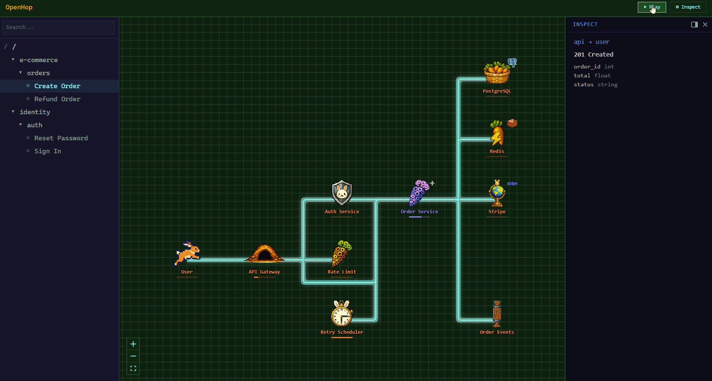
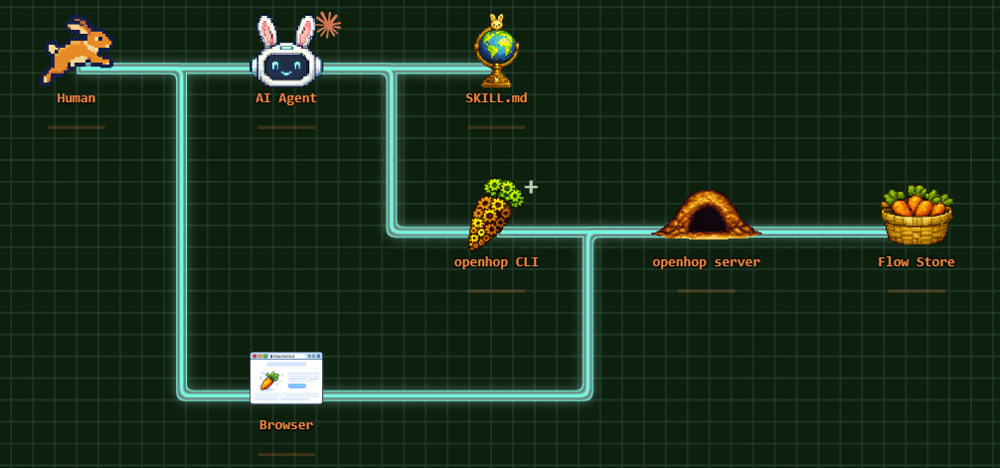

<h1 align="center">OpenHop</h1>

<p align="center">
  
</p>

<p align="center">
  <b>Your AI walks you through your code, one step at a time.</b><br/>
  Animated, multi-level data flows — described in YAML, drawn by your coding agent.
</p>

<p align="center">
  <a href="https://github.com/naorsabag/openhop/actions/workflows/ci.yml"></a>
  <a href="https://www.npmjs.com/package/openhop"></a>
  <a href="LICENSE"></a>
  <a href="https://discord.gg/8RD2fKfXJG"></a>
</p>

<p align="center">
  <a href="https://docs.anthropic.com/en/docs/claude-code/skills"></a>
  <a href="https://cursor.com/docs/skills"></a>
  <a href="https://github.com/openai/codex"></a>
</p>

<p align="center">
  
</p>

<p align="center">
  <a href="#try-it-in-30-seconds">Quickstart</a> ·
  <a href="#live-demo">Live demo</a> ·
  <a href="#token-use">Token use</a> ·
  <a href="#sharing-flows">Sharing</a> ·
  <a href="#install-options">Install</a> ·
  <a href="#use-cases">Use cases</a> ·
  <a href="#how-it-works">How it works</a> ·
  <a href="#examples">Examples</a> ·
  <a href="docs/">Docs</a>
</p>

<p align="center">
  <b>Local-first. Token-light. Your code never leaves your machine. No telemetry.</b>
</p>

---

## Why

AI coding agents are great at explaining how code works — in 800-line bullet walls and complicated static diagrams you can't actually follow.

OpenHop is a skill that lets your agent emit an **animated, multi-level data-flow diagram** instead. You ask in plain English; your agent writes the flow as YAML and pushes it; OpenHop takes care of the rest — and you walk it at your own pace.

**Why an animated flow beats a static Mermaid/PlantUML picture:**

- 🎞 **Step through it, don't squint at it.** Play, pause, prev/next, restart. The flow runs _over time_, the way the code actually does. You watch one hop happen, then the next, then the next.
- 🔍 **Drill into sub-flows.** Click any node to zoom into how it works inside. Infinite depth, same controls at every level.
- 🧠 **Token-light by design.** The YAML the agent emits is a fraction of the prose walkthrough it replaces — see [Token use](#token-use) for the numbers on real flows.
- 🔒 **Local-first, no telemetry.** Your code never leaves your machine. No analytics, no phone-home, no account required.

## Try it in 30 seconds

```bash
npx openhop init
```

**That's it!**

Now restart your agent so it picks up the new skill, and ask:

> "Walk me through the main flow of this codebase."

The agent generates the YAML, pushes it, and returns a URL with the animation playing.

> [!NOTE]
> `npx openhop init` auto-detects Claude Code, Cursor, Windsurf, Cline, and Continue. For other clients, see [Install](#install-options).

## Live demo

Click and play, no install required: **<https://naorsabag.github.io/openhop/>**

## Token use

No MCP server — nothing sits in your context all session. It's an on-demand skill that loads only when you ask for a flow, plus a local CLI the agent shells out to.

Flows are authored in **compact YAML**, not JSON, so the payload the agent emits stays small: **~100 tokens per step** (a 10-step flow ≈ 1,000 tokens of output).

## Sharing flows

OpenHop is local-first — no hosted backend, no flow storage. To share a flow, open the [playground](https://naorsabag.github.io/openhop/), paste your YAML and hit **Save**: the page compresses the flow into the URL hash and copies a self-contained link to your clipboard. Nothing is uploaded — URL fragments stay in the browser.

For flows too large to fit in a URL, share the YAML file directly.

## Install Options

OpenHop is a skill — a `SKILL.md` file your AI agent reads to learn how to render flows. **Installing the skill is the only required step.** The CLI + server (which actually paints the pixels) ship in the same npm package and the agent boots them automatically the first time you ask for a flow.

Pick the install path that matches your AI client.

**Path A — Claude Code, Cursor, Windsurf, Cline, Continue**

```bash
npx openhop init
```

**Path B — Codex CLI, Gemini CLI, Junie, Copilot, OpenCode, Goose, Antigravity, …** (via [OpenSkills](https://github.com/numman-ali/openskills))

```bash
npx openskills install naorsabag/openhop
```

**Path C — plugin install**

```text
/plugin install naorsabag/openhop
```

…or from your agent GUI.

**Want to start the server yourself?**

```bash
npx openhop serve
```

**Just looking?**

```bash
npx openhop demo
```

**Contributors**

```bash
git clone https://github.com/naorsabag/openhop.git
cd openhop && npm install && npm run dev
```

## Use cases

Once the skill is installed, point your agent at a codebase and ask it things like:

- "Walk me through the OAuth flow in this codebase."
- "Diagram how a request flows through this Express app."
- "Show me how the checkout pipeline processes an order, end to end."
- "Trace what happens when a user clicks **Submit**."
- "Visualize the auth middleware — every step, every state transition."
- "How does cache invalidation work in this service?"
- "Diagram the WebSocket reconnection state machine."
- "Walk me through what happens after `npm publish` — every step until the package is on the registry."

The skill activates on prompts asking your agent to **explain, walk through, trace, visualize, or diagram** how data, requests, control, auth, or state flows through code. When it recognizes that shape, it switches from prose to YAML + animation. The full trigger-phrase list lives in [`skills/openhop/SKILL.md`](skills/openhop/SKILL.md).

## CLI

```
openhop serve                        # start API server on :8787
openhop push <file.yaml>             # create a flow, returns ID + URL
openhop patch <flow-id> <file.yaml>  # apply patch operations to an existing flow
openhop list                         # list flows
openhop remove <flow-id>             # delete a flow
```

Flags: `-p, --port <port>` (serve), `-s, --server <url>` (all others).

## How it works

<p align="center">
  <a href="https://naorsabag.github.io/openhop/">
    
  </a>
</p>

<p align="center"><a href="https://naorsabag.github.io/openhop/"><b>▶ View this flow live on the Pages playground</b></a></p>

The CLI validates YAML against a zod schema (with fuzzy typo hints), posts the flow to the API,
and prints a URL. The web UI subscribes and animates data pixels along the edges.

## Examples

Pre-made flows under [`examples/`](examples/):

- `auth-flow.yaml` — OAuth2 login with JWT
- `order-flow.yaml` — e-commerce order pipeline
- `simple-crud.yaml` — minimal CRUD example
- `type-variants.yaml` — every node type in one flow
- `self-loops.yaml` — same-node steps (internal work, retries) plus broadcasts and multi-data steps

Push any of them:

```bash
openhop push examples/order-flow.yaml
```

## Contributing

PRs welcome. See [CONTRIBUTING.md](CONTRIBUTING.md) and [CODE_OF_CONDUCT.md](CODE_OF_CONDUCT.md).
Security reports via [GitHub's private vulnerability reporting](https://github.com/naorsabag/openhop/security/advisories/new).

## Contact

General questions: open a [GitHub issue](https://github.com/naorsabag/openhop/issues/new) or email [openhop.dev@gmail.com](mailto:openhop.dev@gmail.com).

## License

MIT © Naor Sabag. See [LICENSE](LICENSE).
